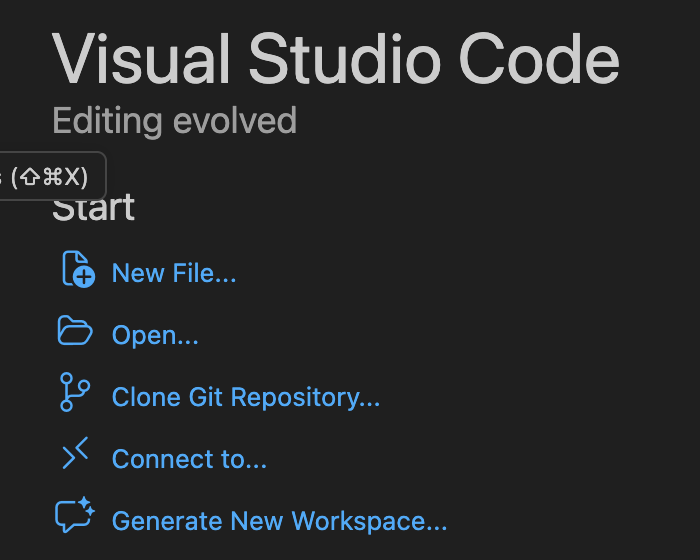
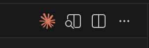
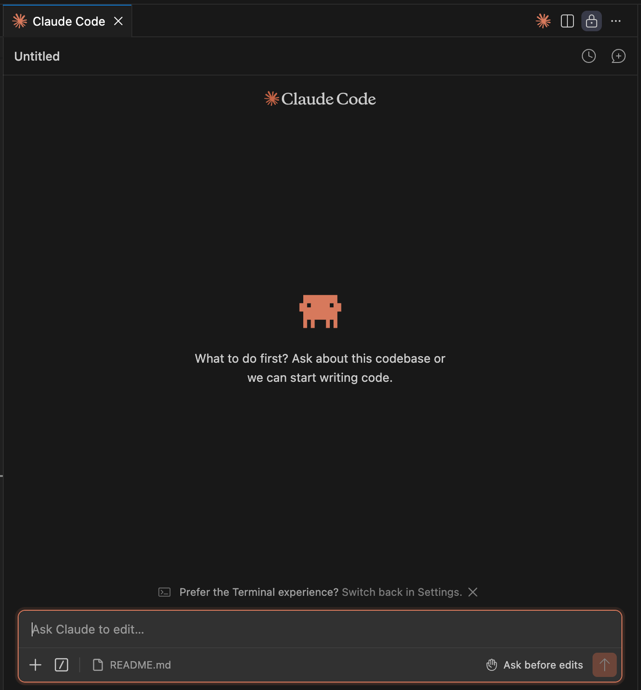

# Automation Town Session 1 #

As part of session 1 we wanted to ensure that you had something to takeaway from the session to try. 

We've put together this Github repo for you to be able to run through some of the concepts that you have learned in Session 1. We'll also guide you through using this readme the steps that you need to complete.

## Getting Started ##

You will need claude code installed. Instructions on Claude Code installation are here https://code.claude.com/docs/en/quickstart

You will need VSCode installed. Install link for VSCode is here https://code.visualstudio.com/download

We recommend using Github Desktop or Git. Github Desktop can be installed from here https://docs.github.com/en/desktop/installing-and-authenticating-to-github-desktop/installing-github-desktop?platform=windows

Alternatively. Git can be installed using these instructions https://docs.github.com/en/get-started/git-basics/set-up-git

*It is not actually necessary to use Git for this tutorial, however it is a useful tool that you should familiarise yourself with*

## Setting Up Your Environment ##

### Direct Download of Project from Github Repo ###

If you're not comfortable with using git yet - on this page you can click the "Code" button on the top right of the page then either Download Zip. This will download a zip file to your computer. 


Unzip the file, and the extracted folder has all files that you need

### Using GitHub Desktop ###

If you wish to use the desktop app, click on Code then "Download Zip"

### Using Git (Command Line) ###

If you are comfortable navigating a terminal, run the command 

``` git clone https://github.com/growthwise/automationtown_session.git ```

This will clone the whole project to the current directory you are in. 

If you also want to ensure that you can "push" to your own Github make sure you authenticate to github from the command line.

Normally the best way to do this is 

``` gh auth login ```

Then select "Github"


For the next question answer "HTTPS"


Say that you do want to use your github credentials to auth, this will use the web interface to authenticate. 


For the option of login say login with web browser


After this, it will prompt inside the terminal to open github in your browser. Remember you need to copy and paste this link into your browser.

Once on the page, enter the provided code and click continue to authorise. You will then be able to click Authorize github to finalise the link. 

If you have MFA enabled you will need to enter this as well. Once connected you will see this


Your terminal will also update with messages stating a successful login. 


If you want to test and confirm your connection you can do so by issuing the following command

``` gh repo list username ``` remembering to replace username with your Github username. If you just created an account, it should show no repositories, Otherwise, it will show anything you've created. 

## Opening Project in VS Code ##

Now that you have downloaded all the project files, we suggest opening the project in VSCode. Open VSCode and then in the window that opens click on "Open" 



Select the folder you extracted or cloned earlier and click open.

On the left hand side now, you will have visibility of all the files from the project. 

You will likely also have a "Chat" window that shows on the right as shown below


You can close the chat window to avoid confusion, Claude will be in its own chat tab. 

*You May also see suggestions in VSCode about installing recommended extensions, you can ignore these, for example the one below that will show due to a PDF being in the project*


### VSCode Extension ###

Now you're in VSCode if you want to use Claude within it go here https://code.claude.com/docs/en/vs-code and download the extension. Once installed it will show as a small icon you can click, and then you will see a familiar chat window. 





At this point, you're just about ready to explore code. More on that below. 

## If You Prefer the Terminal ##

### Terminal Instructions for All Operating Systems ###

If you want to try using the terminal instead, open your terminal application. 

On a Mac, this is in your utilities folder and is called Terminal

In Windows, you can right click your start menu and either stand a command prompt or powershell

In Linux you can move to terminal mode (normally Alt +F1 or F2 etc) or simply open the terminal in your window manager. 

Once you are in your terminal regardless of operating system the steps you should follow are:

- Change directory to the project downloaded or cloned
- Once in that directory, type claude and press enter

Some tips depending on your system

* Mac: Once you open terminal to move into the cloned directory type cd then drag your cloned folder onto the terminal window and it will fill the path, press enter to enter the directory


* Windows: by default normally if you open command prompt it will open into your user folder e.g. C:\Users\username if you downloaded the repository to your downloads folder you can navigate to it using the commands below

``` cd Downloads\automation_session ``` <--- press enter after typing. 

If it is in any other directory you will need to change directory to where it was downloaded. 

*Remember terminals have autocomplete, if you don't want to type an entire path press tab as you type to get autocomplete suggestions*


## Now the fun starts! ##

### Explanation of the Project ###

We have structured this project so that you can familiarise yourself with some concepts. The goal of this project is to create a website for your business. 

- CLAUDE.MD this is the instructions that claude will follow to create the project. You can read through this to understand what claude is going to execute on

- SKILLS if you are in VSCode you will see a skills folder, inside that folder we've got 4 different skills preloaded for this project. Again for each of these, if you want to understand what each one does click on SKILL.MD in the folder and you can see its instructions. 

- images directory: If you already have some brand assets e.g. logo, banners, social media templates you can add them to this directory. 

- Output folder: This is where your generated site will be, but we've also added a .gitignore file within it so if you want to test pushing back to github it will exclude that folder. You can adjust this as you wish. 

### What Happens Now? ###

We aimed to have this project setup as a "turnkey" setup. To get started all you need to do is either in your terminal, or in your claude chat window in VSCode type the following and presss enter:

``` Read CLAUDE.MD and get started ```

You will be guided through the creation of the site

## My site now works what else can I do? ##

### Do further changes to the site ###

Once you are at the stage of having the site operational, you can continue to iterate on it. Try prompts for example

``` We offer boutique services to international businesses. Add a page that outlines these services ```

Or

``` I don't like the colour schemed, can you try a different theme using the theme-factory skill ```

And... as a bonus because everyone hates em dashes we included a skill that's not used but you can request Claude to utilise it. We kept this one separate so you can explore the concept of triggering a skill. 

``` Use the humanizer skill to update the text on the website ```

* hint: Theme factory directory has a PDF in it that can show you each theme, choose your own adventure... 
* If you like as well, ask Claude to use the seo-audit-skill to audit your existing website

### I don't need a new website, can I do something different? ###

Yes! 

If you want to do something completely different the structure is the same:

- Create a new folder to work from
- Create a CLAUDE.MD file within that folder, outline what you want to be able to create, remember you can use Claude desktop app or the claude online chat initially to create this
- When your CLAUDE.MD is ready, issue the same "Read and get started" chat and watch claude start its process.

Want some further inspriation on what you may be able to build? Check out Chad's linkedin post for some ideas here https://www.linkedin.com/feed/update/urn:li:activity:7444427727610351617/

### Helpful Slash Commands ###

Many of the things you can see in the web interface are accessible in Claude code 

- ```/clear``` Clears context

- ```/usage``` Shows model usage, in VSCode you will see "Account Usage" click this to see usage

- ```/model``` Adjust which model you are using for your coding tasks

- ```/stats``` A fun one, shows you how much you've used Claude over time

#### Links to Skill Resources ####

We are providing these so you are aware of where each skill was retrieved from

frontend-design https://github.com/anthropics/skills/tree/main/skills/frontend-design

humanizer https://github.com/blader/humanizer/tree/main

theme-factory https://github.com/anthropics/skills/tree/main/skills/theme-factory

seo-audit-skill https://github.com/seo-skills/seo-audit-skill/tree/main/skill

#### Further Resources ####

This repo was created for the Claude Cohort of automationtown.io. All sessions facilitated by https://www.linkedin.com/in/chaddavis1/ with guests:

Commences Beginning of April
- Weeks 1 and 2 - https://www.linkedin.com/in/beaugaudron/ 
- Week 3 - https://www.linkedin.com/in/johnikos/
- Week 4 - https://www.linkedin.com/in/awittenberg17/
- Week 5 - Demo Day show what you built!
